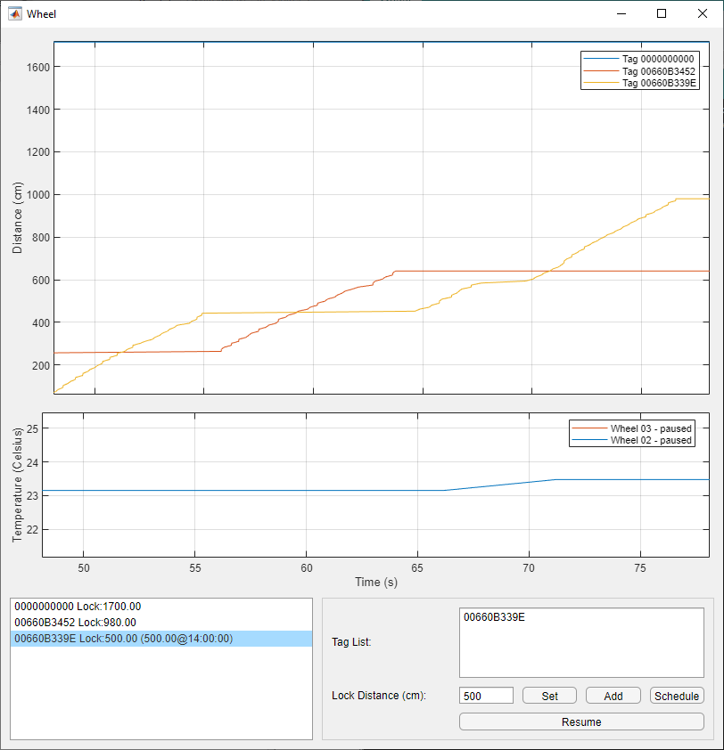

# Running wheel
Control program for a custom made running wheel with a locking mechanism.

## Prerequisites
* Wheel Control (on request) to install the control program.
* [Arduino IDE][Arduino] to upload the firmware to the micro-controller of the wheel (last compiled and tested with Arduino 1.8.5).
* [MATLAB][MATLAB] only if planning on editing the source code (last tested with R2019a).

## Install control program
* Download and install Wheel Control.
* Download and install [Arduino][Arduino].

## Version History
See [release notes][Release Notes]

[Leonardo Molina]: https://github.com/leomol
[Arduino]: https://www.arduino.cc/en/Main/Software
[MATLAB]: https://www.mathworks.com/downloads/
[Release Notes]: release-notes.md